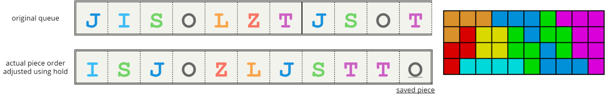
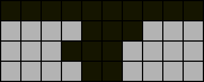

# The Typical Perfect Clear (PC)

All ensuing discussion assumes the following conditions:

## Uses the 7-bag randomiser

  

With this mode of random piece generation, pieces are generated in _“bags”_ of seven. Each bag includes all seven distinct pieces (`T`, `I`, `L`, `J`, `S`, `Z`, `O`) in random order. This is important for us since it grants a certain degree of predictability by periodically ensuring the appearance of all pieces. The term _“bag”_ usually refers exclusively to a 7-bag.

PC runs/Tetris games that generate pieces completely randomly (i.e. the following piece is always independent of the current piece) are known as _“memoryless”_.

## Four line (4L) by default

This is a practical constraint. Assuming single-player gameplay as in PC mode or no garbage is received otherwise, multiples of two lines must be cleared starting from an empty board to achieve a PC. However, as two line (2L) PCs are only rarely possible and may sometimes even be undesirable, PCs are typically done by clearing in multiples of four lines, which is conventionally the maximum number of cleared lines that is permitted by the next completed PC before a consecutive PC run is halted. There exist advanced PC setups such as DPC setups and PC endings to popular openers such as Gamushiro Stacking that exceed four lines, but these are out of the scope of our discussion and can be analysed using the same methods as regular consecutive PCs which will be our main concern. For our purposes, the field beyond the bottom four rows is irrelevant.

## Utilises hold

The hold mechanism allows enormous flexibility in rearranging piece order and allows us to consider an additional piece: the first piece from the next PC can be swapped with any piece from the current PC. This can cause the next PC to start with a piece that has a duplicate piece in the rest of the bag. The hold piece or the immediate next piece if there is none when the next PC begins is known as the _“saved”_ piece or _“save”_.

  

## Checkpoint

1. State the next piece that will appear in the queue if the game has just started, your current piece is `I`, and the following pieces in the queue are `S`, `Z`, `O`, `L`, `T`.
1. Determine the total number of pieces used in seven 4L PCs.
1. The queue is `T,J,L`. List all possible orders in which these pieces can be placed.
1. Determine all possible saves if the queue is `T,J,L` and the field is the following:

  

