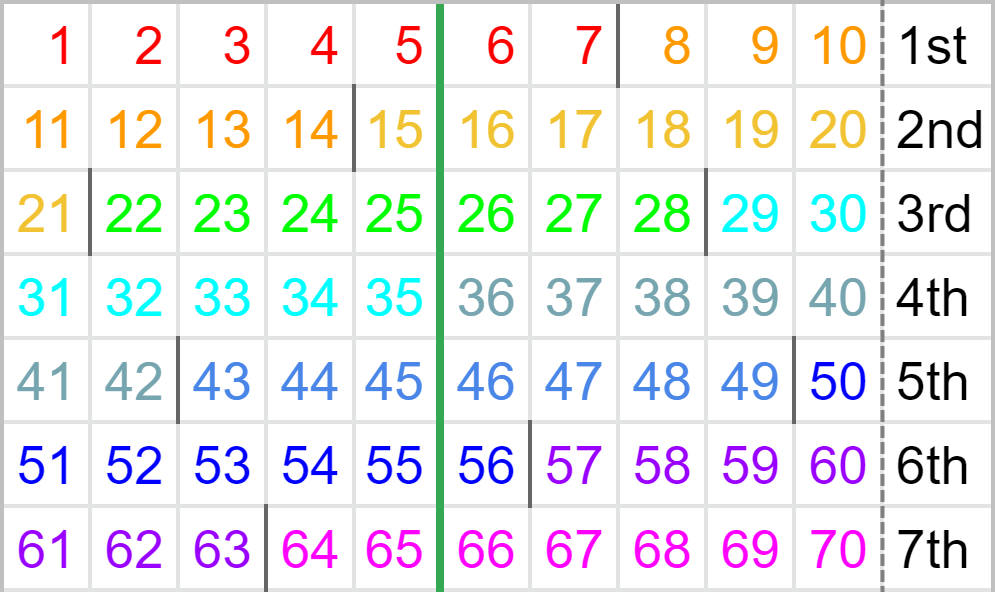
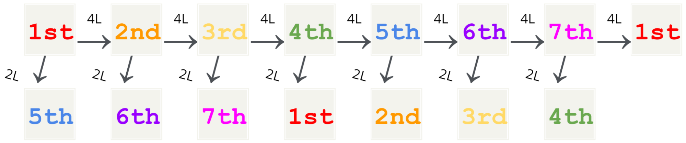

# Counting PCs

There is a loop every seven 4L PCs as exactly ten bags are used. As we will see, considering only the boundaries between bags, which define the character of each PC, the 1st PC is essentially identical to the 8th, the 2nd is to the 9th, and so forth for PCs seven apart. For this reason, PCs are conventionally specified by an ordinal number from 1st to 7th known simply as the “PC number”. Given this number, we can determine how much of the current bag has elapsed and expect the pieces available for the next PC to some extent.

Discussion of individual setups should always mention the PC number. Even though the same shape and constituent pieces may be reused as setups for different PCs, having a different piece distribution can sway PC chances.

  

For each row in the chart above, the rightmost cell indicates which PC, the numbers indicate how many pieces are used, and the dark lines between numbers mark boundaries between the distinctly coloured bags. The pieces used in a 2L PC precede the green line.

Observe how each PC is divided differently by the boundaries of the bags.

  

While 4L PCs advance the PC number by one, 2L PCs advance the PC number by four (e.g. after completing a 3rd PC with a 2L solution, the next PC is equivalent to the 7th PC). Although keeping count of PCs would suffice, mathematically, the PC number when the field is empty is given by the formula:

\\[ \left[ \left( \text{number of pieces used in complete PCs} \times 5 \right) \mod{7} \right] + 1 \\]

### Sidenote on the 70-piece loop

The attentive or experienced reader may have noticed that a loop may not strictly be sustained in the case the player does not use all seven pieces in the second bag during the 7th PC and instead uses a piece from the following bag that belongs to the 1st PC. This scenario is known as a _“duplicate piece”_ 1st PC or informally the “8th” PC.

Known 7th PC setups often use the remaining three pieces from the first bag and are designed in mind to only use the seven pieces from the second bag, bypassing such concerns. However, as duplicate piece 1st setups that utilise said saves are being investigated, it may sometimes be favourable to forgo completion of the 70-piece loop.

## Checkpoint

1. Determine the current PC number if the field is now empty, 14 PCs have been completed, four of which were 2L PCs and the rest 4L PCs.

## Exercises

1. Explain why openers that use exactly five bags and have a high chance of finishing with a PC (e.g. BT Cannon) can be a viable loop while those that do not but also have a high chance of finishing with a PC (e.g. Gamushiro Stacking uses 20 pieces) cannot be looped on its own.
1. Explain why any single variant of tetromino could be missing from the entire piece queue (with holding considered) during the 4th and 6th PCs.
1. In which PC(s) is/are a 2L PC with 2 `I` pieces and 3 `O` pieces possible?
1. The field is currently empty. The hold piece is `T`, the current piece is `J`, and the visible queue shows the next five pieces `O,I,O,T,J`. What PC(s) could this be?
