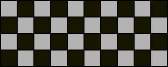
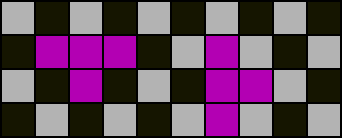
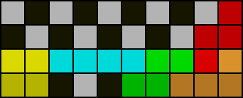
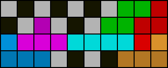
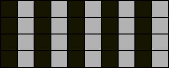
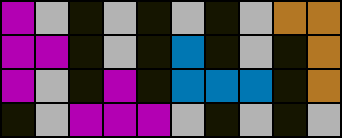

# Parity

Parity rules in the context of PC determine whether a PC is possible based only on the orientation and quantity of the given pieces. We will only discuss the most commonly known parity rules. The reader is encouraged to verify statements that are hereupon presented as fact.

## Checkerboard parity

  

An empty 10x4 field is checkered as shown. For each PC, an equal amount of light cells and dark cells must be filled.

<u>The checkerboard parity rule states that the number of `T` pieces and number of _“odd”_ line clears together must sum to an even number for any PC.</u> An _“odd”_ line clear is when the total number of empty cells above or below the cleared line is odd. All _“boxes”_ (rectangular areas) with an even horizontal or vertical dimension must obey this rule.

  

Of all the tetrominos, only the `T` piece changes checkerboard parity by filling two more cells of either colour than of the other.

   

Notice how light cells become dark cells and vice versa when one line is cleared. On the left is an example of an _“odd”_ line clear, and on the right is an example of an _“even”_ line clear which does not affect checkerboard parity.

## Column / vertical parity

  

An empty 10x4 field is shaded as shown. Again for this colouring, for each PC, an equal amount of light cells and dark cells must be filled. `L` piece, `J` piece, and _“vertical”_ `T` piece placements change column parity. Column parity is not affected by line clears. For most purposes, vertical `I` piece placements are not considered.

<u>The column parity rule states that the number of `L` pieces, `J` pieces, and _“vertical”_ `T` pieces together must sum to an even number for any PC.</u> All boxes with an area that is multiple of four squares must obey this rule.

  

A `T` piece is _“vertical”_ if either rotated clockwise once or counterclockwise once from the original orientation and _“horizontal”_ otherwise. The `T` piece on the far left is a _“vertical”_ `T` piece and the `T` piece in the middle is a _“horizontal”_ `T` piece. All `L` pieces and `J` pieces regardless of orientation and _“vertical”_ `T` pieces affect column parity by filling two more cells of either colour than of the other.

## Exercises

1. Determine the minimum total of `L`, `J`, and `T` pieces necessary to complete any box if at least one `S` or `Z` piece must be used.
2. Explain why it is impossible to PC a 6x4 box with queue `SZ,[ILSZO]p4`.
3. Determine whether it is possible to save `T` in 2nd PC with queue `[JSZO]p4,\*p7`.
4. Given a 4L PC solution exists with queue `ILSZSLIZJTO`, determine all possible orientations of the `T` piece and if it can be unused.
5. Capella uses 6-3 stacking and completes 1st PC with a Tetris as shown on the cover page. Determine whether it is possible to complete a 2nd 4L PC with a Tetris.
