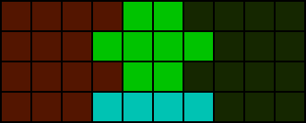
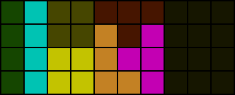
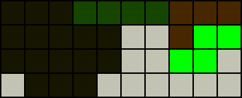
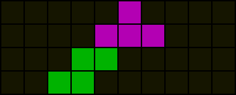

# Piece dependency

Piece dependencies in the context of PC refer to how specific pieces must be placed in certain places for a PC to occur due to the arrangement of existing filled cells. It is advisable to avoid dependencies unless the required pieces are expected to be present.

## Field division

  

The total number of empty cells in completely separate individual regions must be divisible by four for a PC to occur. If a field has separate regions that cannot be rejoined by line clearing and any of those separate regions have a total of empty cells that is indivisible by four, the field is impossible to PC in four lines.

## Single piece dependencies

  

In the above field, the solid cells are placed pieces whereas the shaded cells indicate dependencies. `T`, `I`, and `O` pieces are said to be _“fixed”_ to their respective shaded regions. Notably, while the highlighted `T` dependency is connected to a larger empty region to the right, any piece that overlaps both would cause the resulting regions to each have a total of empty cells indivisible by four. The logic is similar for the `O` dependency.

  

Some dependencies are discernible by parity or by enumeration of all possibilities. Observe how a `T` dependency is present above.

## Queue-dependent piece fixing

In practice, taking into account the actual queue can help decide piece placements.

  

The grey cells comprise a residue following the TSD of a well-known DPC setup. The queue is `*p7` and a PC is 100% possible without considering the following bag. Placing the S piece as shown would fix the `L` piece which would then also fix the `I` piece as it becomes the only piece that can fill the one high space in the 6th and 7th columns from the left.

In actuality, the `I` piece can be placed regardless without jeopardising PC chances.

### Sidenote

A piece being fixed in a region does not imply it must occupy any single fixed cell in the region. The diagrams shown are a simplistic representation.

## Exercises

1. Considering only the bottom four rows, determine whether the following is true:
   - Any piece that is at least three high must divide the board.
2. Determine whether it is possible at all to PC the following field with any queue: 
  

3. Identify all piece dependencies in the following field: 
  

