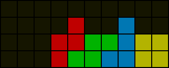
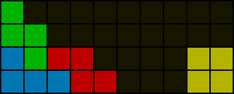

# Introduction to setups

Setups are shapes that usually involve the first few pieces in each PC and have been discovered to give good PC chances and saves. As a rule of thumb, good setups should be able to accommodate many piece combinations that could appear in the queue. Even when just freestyling, one should avoid creating irreconcilable dependencies.

Most setups use three to four pieces. It is possible to find solutions to three piece setups assuming visibility of five future pieces in the queue. If a solution cannot be found immediately, it is also possible to transition to known four piece setups. By the fourth piece placed, all pieces that can be used in the PC have already appeared in the queue, so it is advisable to avoid placing more pieces before finding a solution.

When referring to setups, the most reliable and precise way is to simply use fumen as many an effort to devise simple readable notations for setups has resulted in grim outcomes. Mirrored setups may not have the same success rate due to SRS `I`-spins, and horizontally translated setups may surprisingly have the same problem due to SRS wall kicks: the orientation and positioning of setups are not useless information. In the community, many shapes (not setups) are given curious short English names that can double as embarrassing relics. For instance, a vertical `T` alone instead of the entire opener can be recognised as the shape _“PCO”_ despite what the abbreviation usually suggests.

   

Above are 2nd PC setups for the queue `[JSZO]p4`. The setup on the left has a success rate of 80.00% and that on the right (the left half of which is known as _“feet”_ or _“shoe”_) has a success rate of 94.21%. Notice how the worse setup fixes two pieces whereas the better setup is far more flexible. In a PC run, the setup on the right would either be used as is or as a three-piece setup by omitting the `O` or `Z` piece to increase chances, or even avoided altogether by saving other pieces because of its dissatisfactory chances and saves. The strategy may be different for two-minute Blitz / Ultra runs that emphasise score instead; even top players may sacrifice PC success rate for setups with more patent solutions in order to save thinking time.

In the process of studying setups, it is advantageous to be familiar with their solutions and possible continuations. The term _“minimals”_ refers to any smallest set of solutions for a setup that encompasses all solvable queues. The size of the set can serve as a rough measure of the difficulty of solving the setup. Minimals are not always unique.
